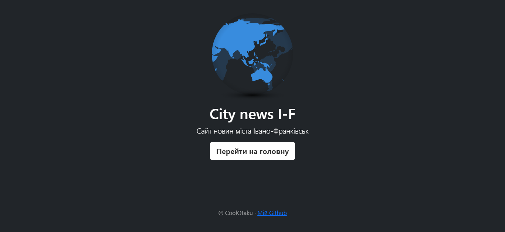
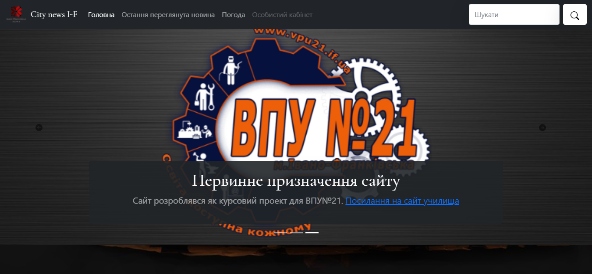
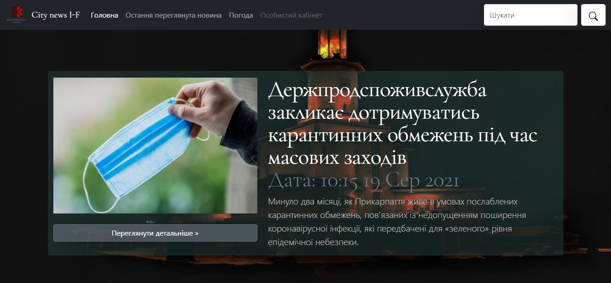
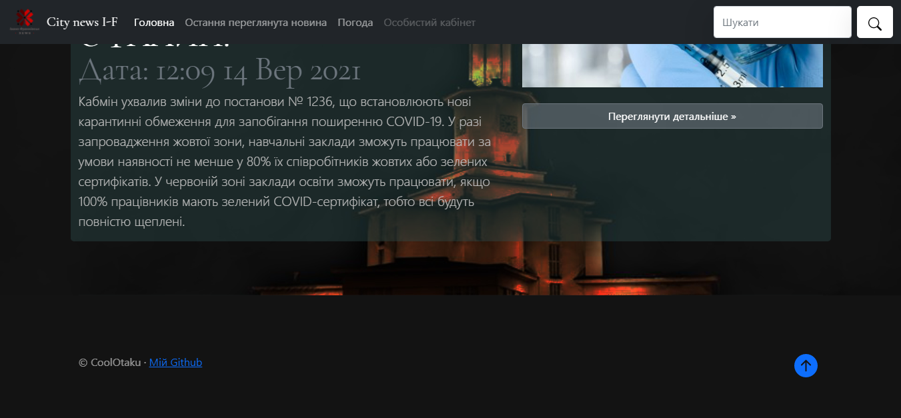
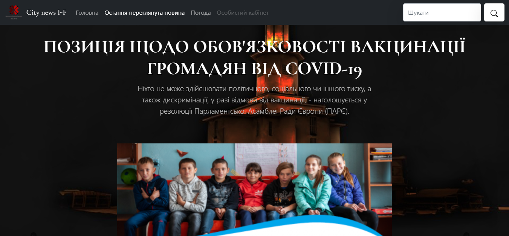
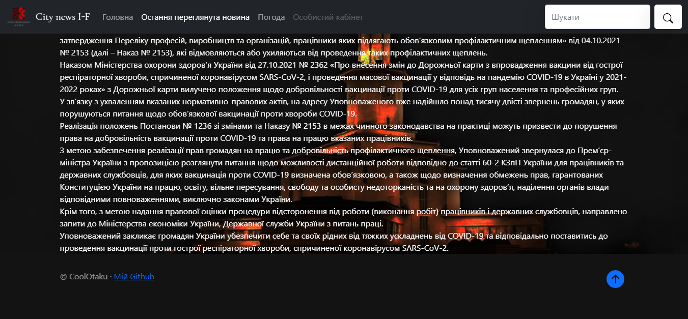
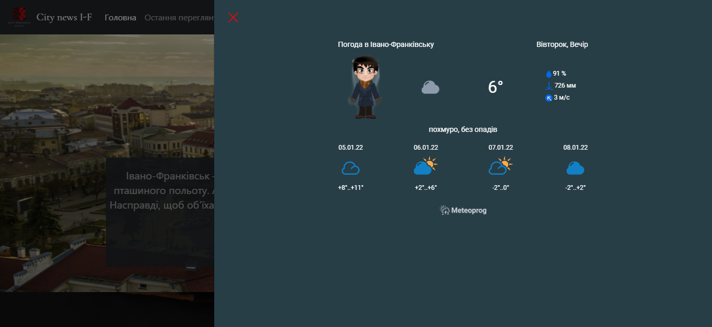
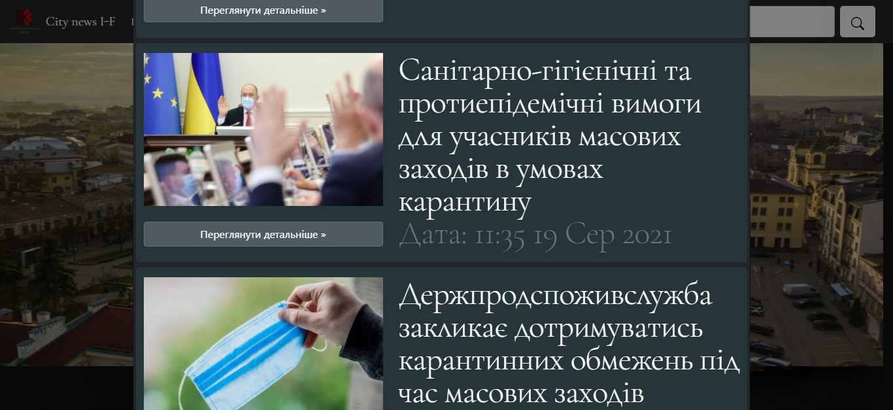
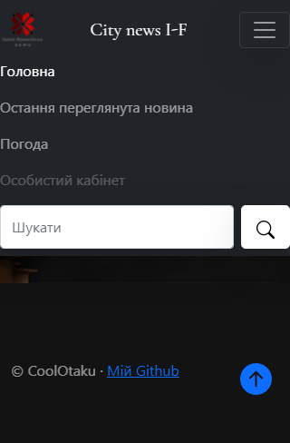
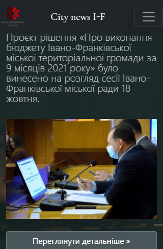

<p align="center"></p>
<h1 align="center">City news I-F</h1>

## Description
<b>EN:</b>

This is my course work on web design. Theme of the site "**Ivano-Frankivsk** City News Site". No use of the **API**, just the interface for now.

<b>UA:</b>

Це є моя курсова робота, по веб дизайну. Тематика сайту "Сайт новин міста **Івано-Франківськ**". Без використання **API**, поки лише інтерфейс.

#
## Screenshots
<p>
  
  
  
  
  
  
  
  
  
  
  
  
</p>

#
## Technologies used
<b>EN:</b>
- Using [**Bootstrap**](https://getbootstrap.com) (front-end framework)
- Data storage in files in **JSON** format (without using the **API**)
- Using the library [**jQuery**](https://jquery.com)
- Using the ***Cookie*** system
- Using the weather **API** ([www.meteoprog.ua](https://www.meteoprog.com/ua/))
- Search for information and navigation on the site

<b>UA:</b>
- Використання [**Bootstrap**](https://getbootstrap.com) (front-end framework)
- Зберігання даних у файлах у форматі **JSON** (без використання **API**)
- Використання бібліотеки [**jQuery**](https://jquery.com)
- Використання системи ***Cookie***
- Використання **API** погоди ([www.meteoprog.ua](https://www.meteoprog.com/ua/))
- Пошук інформації та навігація на сайті

#
## License
```
© 2022, CoolOtaku (ericspz531@gmail.com)
```
